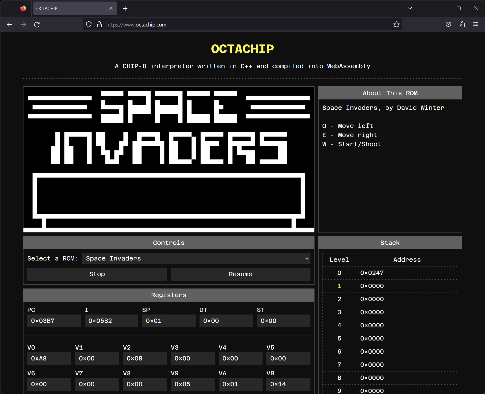

# OCTACHIP

A CHIP-8 interpreter written in C++ that compiles to native code and WebAssembly.

Visit [www.octachip.com](https://www.octachip.com/) to access a live demo of the web application.



## About CHIP-8
From [Wikipedia](https://en.wikipedia.org/wiki/CHIP-8):

>CHIP-8 is an interpreted programming language, developed by Joseph Weisbecker made on his 1802 Microprocessor. It was initially used on the COSMAC VIP and Telmac 1800 8-bit microcomputers in the mid-1970s. CHIP-8 programs are run on a CHIP-8 virtual machine. It was made to allow video games to be more easily programmed for these computers. The simplicity of CHIP-8, and its long history and popularity, has ensured that CHIP-8 emulators and programs are still being made to this day.

## Dependencies
- [CMake](https://cmake.org/)
- _For building the desktop program_
    - Build system
        - Linux: GNU Make
        - MacOS: GNU Make
        - Windows: Visual Studio
    - C++17 compiler
        - Linux: GNU GCC
        - MacOS: Apple Clang
        - Windows: MSVC
    - Included in the CMake configuration
        - [cxxopts](https://github.com/jarro2783/cxxopts) - Command line option parser
        - [GoogleTest](https://github.com/google/googletest) - Unit testing library
        - [SDL2](https://github.com/libsdl-org/SDL) - Graphics and keyboard input library
- _For building the web application_
    - [Emscripten SDK](https://emscripten.org/) - Compiler toolchain to WebAssembly

## Building the desktop program
Use these commands to clone the repository and build a native executable for Linux, MacOS, or Windows.

```bash
# Clone the repository
git clone git@github.com:kochius/OCTACHIP.git

# Enter the repository directory
cd OCTACHIP

# Configure CMake in a build directory
# CMake supports different build types (e.g. Release, Debug)
cmake -B build -DCMAKE_BUILD_TYPE=<BUILD_TYPE>

# Build the project with the given configuration
cmake --build build --config <BUILD_TYPE>
```

If the build is successful, these commands will output the executable `octachip` in the `./build/dist/` directory on Linux and MacOS, or the `./build/dist/<BUILD_TYPE>/` directory on Windows.

## Building the web application
First, ensure that the Emscripten SDK is downloaded, installed, and activated for the current terminal following the instructions on [the official page](https://emscripten.org/docs/getting_started/downloads.html). Then, use these commands to clone the repository and build the web application with Emscripten.

```bash
# Clone the repository
git clone git@github.com:kochius/OCTACHIP.git

# Enter the repository directory
cd OCTACHIP

# Configure CMake to use Emscripten in a build directory
# CMake supports different build types (e.g. Release, Debug)
emcmake cmake -B build -DCMAKE_BUILD_TYPE=<BUILD_TYPE>

# Build the project with the given configuration
cmake --build build --config <BUILD_TYPE>
```

If the build is successful, these commands will output the following files in the `./build/dist/` directory on  Linux and MacOS, or the `./build/dist/<BUILD_TYPE>/` directory on Windows.

- `octachip.data` - CHIP-8 ROM files packaged and preloaded for Emscripten's virtual filesystem
- `octachip.js` - "Glue code" that provides API support for the compiled WebAssembly code
- `octachip.wasm` - Compiled WebAssembly code

In addition to the files emitted by Emscripten, the web application needs the files located in the `./web/` directory, which can be copied to the distribution directory using the `cp` command.

```bash
# Consolidate the web application files
cp web/* build/dist # build/dist/<BUILD_TYPE> on Windows
```

Once all the files are consolidated, the web application can be served with a local web server, such as Python's built-in `http.server` module.

```bash
# Enter the distribution directory
cd build/dist # build/dist/<BUILD_TYPE> on Windows

# Access the web application at http://localhost:8000/
python3 -m http.server 8000
```

## Testing
The unit tests for OCTACHIP cover the entire CHIP-8 instruction set. The executable for these unit tests, `octachip_tests`, is generated when building the desktop program. If the build is successful, CMake will output `octachip_tests` in the `./build/tests_bin/` directory on Linux and MacOS, or the `./build/tests_bin/<BUILD_TYPE>/` directory on Windows.

The executable can be run directly.

```bash
# Execute the unit tests directly
./octachip_tests
```

Alternatively, the unit tests can be run using CMake's `ctest` executable from the `./build/` directory.

```bash
# Execute the unit tests with CTest
ctest -C <BUILD_TYPE>
```

## Desktop program usage
The desktop program should be run from the command line.

```
Usage:
  octachip [OPTION...]

  -h, --help       Print usage
  -r, --rom arg    ROM file path
  -s, --speed arg  Emulation speed (in ticks per second) (default: 800)
  -x, --scale arg  Window scale factor (default: 20)
```

Notes
- `-r, --rom` is a required argument; the others are optional
- Several ROMs are included in the `./roms` directory of this repository

## Web application usage
Visit [www.octachip.com](https://www.octachip.com/) to view a live demo of the web application.

## References
- [CHIP-8 - Wikipedia](https://en.wikipedia.org/wiki/CHIP-8)
- [Cowgod's Chip-8 Technical Reference](http://devernay.free.fr/hacks/chip8/C8TECH10.HTM)
- [CHIP-8 Technical Reference by Matthew Mikolay](https://github.com/mattmikolay/chip-8/wiki/CHIP%E2%80%908-Technical-Reference)

## License
The source code for OCTACHIP is licensed under the [MIT License](LICENSE).
